# AWS Secure EKS Infrastructure - Architecture Diagram

This diagram shows how the secure EKS infrastructure works, including the DevSecOps pipeline, networking, and security components.

```mermaid
graph TB
    subgraph "Developer Workflow"
        DEV[Developer] -->|1. Commits Terraform Code| GIT[GitHub Repository]
    end

    subgraph "CI/CD Pipeline - GitHub Actions"
        GIT -->|2. Triggers on PR/Push| WORKFLOW[terraform-security.yml]

        WORKFLOW -->|3. Parallel Security Scans| SEC_JOB[Security Job]

        SEC_JOB --> FMT[Terraform Format Check]
        SEC_JOB --> VALIDATE[Terraform Validate]
        SEC_JOB --> TFSEC[tfsec Scanner]
        SEC_JOB --> CHECKOV[Checkov Policy Check]
        SEC_JOB --> TRIVY[Trivy Vulnerability Scan]
        SEC_JOB --> GITLEAKS[Gitleaks Secret Detection]
        SEC_JOB --> INFRACOST[Infracost Analysis]

        TFSEC -->|SARIF Report| GHSEC[GitHub Security Tab]
        CHECKOV -->|SARIF Report| GHSEC
        TRIVY -->|SARIF Report| GHSEC

        SEC_JOB -->|4. All Checks Pass| PLAN_JOB[Terraform Plan Job]
        PLAN_JOB -->|5. Connects via OIDC| AWS_CREDS[AWS Credentials]
        PLAN_JOB -->|6. Reads State| S3_BACKEND[(S3 Backend<br/>terraform-state)]
        PLAN_JOB -->|7. State Locking| DYNAMO[(DynamoDB<br/>state-lock)]
        PLAN_JOB -->|8. Posts Results| PR[Pull Request Comment]
    end

    subgraph "Terraform Deployment - AWS us-east-1"
        APPLY[Terraform Apply<br/>After Approval] -->|9. Creates| VPC_MOD[VPC Module]
        APPLY -->|10. Creates| IAM_ROLES[IAM Roles]
        APPLY -->|11. Creates| EKS_CLUSTER[EKS Cluster]
        APPLY -->|12. Creates| NODE_GROUP[EKS Node Group]

        subgraph "VPC - 10.0.0.0/16"
            VPC_MOD --> AZ1[Availability Zone 1a]
            VPC_MOD --> AZ2[Availability Zone 1b]

            AZ1 --> PRIV1[Private Subnet<br/>10.0.1.0/24]
            AZ1 --> PUB1[Public Subnet<br/>10.0.101.0/24]

            AZ2 --> PRIV2[Private Subnet<br/>10.0.2.0/24]
            AZ2 --> PUB2[Public Subnet<br/>10.0.102.0/24]

            PUB1 --> NAT[NAT Gateway]
            PRIV1 -.->|Internet via| NAT
            PRIV2 -.->|Internet via| NAT
        end

        subgraph "IAM Layer"
            IAM_ROLES --> CLUSTER_ROLE[EKS Cluster Role<br/>AmazonEKSClusterPolicy]
            IAM_ROLES --> NODE_ROLE[EKS Node Role]
            NODE_ROLE --> POLICY1[AmazonEKSWorkerNodePolicy]
            NODE_ROLE --> POLICY2[AmazonEKS_CNI_Policy]
            NODE_ROLE --> POLICY3[EC2ContainerRegistryReadOnly]
        end

        subgraph "EKS Control Plane"
            EKS_CLUSTER -->|Uses| CLUSTER_ROLE
            EKS_CLUSTER -->|Kubernetes 1.28| K8S_API[Kubernetes API Server]
            EKS_CLUSTER -->|Encrypted etcd| ETCD[etcd Storage]
        end

        subgraph "Worker Nodes - Private Subnets"
            NODE_GROUP -->|Uses| NODE_ROLE
            NODE_GROUP -->|Deploys to| PRIV1
            NODE_GROUP -->|Deploys to| PRIV2
            NODE_GROUP --> NODE1[t3.medium Node 1]
            NODE_GROUP --> NODE2[t3.medium Node 2]
            NODE_GROUP -.->|Auto-scales 1-3| NODE3[t3.medium Node 3<br/>optional]
        end

        K8S_API <-->|Manages| NODE1
        K8S_API <-->|Manages| NODE2
        K8S_API <-->|Manages| NODE3
    end

    subgraph "Security & Monitoring"
        EKS_CLUSTER -->|Audit Logs| CLOUDWATCH[CloudWatch Logs]
        VPC_MOD -->|Flow Logs| CLOUDWATCH
        CLOUDWATCH -->|Monitoring| CLOUDTRAIL[CloudTrail]
    end

    subgraph "Application Deployment"
        KUBECTL[kubectl] -->|13. Deploy Workloads| K8S_API
        K8S_API -->|Schedules| NODE1
        K8S_API -->|Schedules| NODE2
        PUB1 -->|Load Balancer| APP[Application Services]
        PUB2 -->|Load Balancer| APP
    end

    style GIT fill:#f9f,stroke:#333,stroke-width:2px
    style SEC_JOB fill:#ff9,stroke:#333,stroke-width:2px
    style GHSEC fill:#f66,stroke:#333,stroke-width:2px
    style EKS_CLUSTER fill:#6cf,stroke:#333,stroke-width:3px
    style NODE_GROUP fill:#9f9,stroke:#333,stroke-width:2px
    style CLOUDWATCH fill:#fc6,stroke:#333,stroke-width:2px
```

## Component Overview

### 1. Developer Workflow
- Developers commit Terraform infrastructure code to GitHub
- Changes trigger automated security pipeline

### 2. CI/CD Security Pipeline
- **7 Automated Security Scans**: tfsec, Checkov, Trivy, Gitleaks, Infracost
- **SARIF Reports**: Integration with GitHub Security Tab
- **Terraform Plan**: Preview infrastructure changes before deployment

### 3. VPC Architecture
- **Multi-AZ Setup**: High availability across 2 availability zones
- **Network Segmentation**: Public subnets for load balancers, private for worker nodes
- **NAT Gateway**: Secure internet access for private instances

### 4. IAM Security
- **Least Privilege**: Separate roles for cluster and worker nodes
- **AWS Managed Policies**: EKS, CNI, and ECR access

### 5. EKS Cluster
- **Kubernetes 1.28**: Managed control plane
- **Encrypted Storage**: etcd encryption at rest
- **Auto-scaling**: 1-3 worker nodes based on demand

### 6. Monitoring & Compliance
- **CloudWatch**: Centralized logging and metrics
- **CloudTrail**: Audit trail for compliance
- **Flow Logs**: Network traffic monitoring

## How to View This Diagram

**Option 1: VSCode Preview (Recommended)**
1. Install the "Markdown Preview Mermaid Support" extension
2. Open this file in VSCode
3. Press `Ctrl+Shift+V` (or `Cmd+Shift+V` on Mac) to preview

**Option 2: Online Mermaid Editor**
1. Visit https://mermaid.live
2. Copy the mermaid code block and paste it into the editor

**Option 3: GitHub**
1. Commit this file to your repository
2. View it on GitHub (native mermaid rendering)
